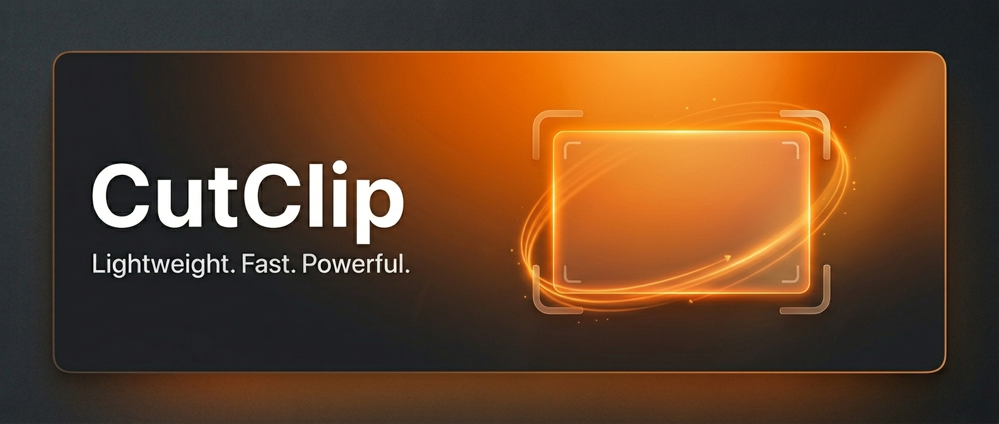

# CutClip

**CutClip** is a lightweight Windows desktop utility for quick screen-region recording. Select any area of your screen, record it, and get a timestamped video saved automatically to your Videos folder.

## Features

### Recording
- **Region selection** — click-and-drag overlay across all monitors (DPI-aware)
- **Screen recording** — Windows Graphics Capture API with FFmpeg encoding (H.264 MP4, VP9 WebM, GIF)
- **Auto-save** — files saved to `%USERPROFILE%\Videos\CutClip_yyyy-MM-dd_HH-mm-ss.{mp4|webm|gif}`
- **Recording chrome** — orange border around the capture area (outside the recorded pixels) plus a floating toolbar with Pause, Save, and elapsed timer
- **Pause / resume** — pause encoding without stopping the session
- **Countdown** — optional 3 or 5 second countdown before recording starts

### System tray & hotkeys
- **System tray** — runs quietly in the background
- **Custom global hotkey** — click-to-capture any key combo (e.g. **Alt + F**, **F9**); modifiers supported
- **Notifications** — tray balloon tips for recording started, saved, and errors (can be disabled)
- **Click saved notification** — opens File Explorer with the recording selected

### Settings (persisted to `%LocalAppData%\CutClip\settings.json`)
- **FPS** — 24 / 30 / 60
- **Output format** — MP4, WebM, GIF
- **Countdown** — 0, 3, or 5 seconds
- **System audio** — WASAPI loopback (recommended) or Stereo Mix via DirectShow
- **Microphone** — WASAPI or DirectShow
- **Copy to clipboard** — optionally copy the saved video file to the clipboard when recording finishes (default: off)
- **Disable notifications** — suppress all tray balloon notifications (default: off)
- **Hotkey** — any key + Ctrl / Alt / Shift / Win

### Other
- **Recent recordings** — in-app list with Open button
- **Open Videos folder** — from the tray menu

## Requirements

- **Windows 10 version 1903+** or Windows 11
- **[FFmpeg](https://ffmpeg.org/download.html)** on your PATH (must include `ffmpeg.exe`)
  - For **system audio**, use a build with **WASAPI** (e.g. [gyan.dev FFmpeg builds](https://www.gyan.dev/ffmpeg/builds/)), or enable **Stereo Mix** in Windows sound settings
- **.NET 8 Runtime** — not required for the self-contained published build

## Quick Start

### Run from source

```powershell
dotnet restore CutClip.sln
dotnet run --project src/CutClip/CutClip.csproj
```

### Publish portable executable

```powershell
dotnet publish src/CutClip/CutClip.csproj `
  -c Release `
  -r win-x64 `
  --self-contained true `
  -p:PublishSingleFile=true `
  -o ./artifacts
```

The output is `./artifacts/CutClip.exe`.

## Usage

1. Launch CutClip — it appears in the system tray.
2. Click **Select Region & Record** (or press your configured hotkey).
3. Drag a rectangle over the area you want to capture, then press **Enter** or release the mouse.
4. Use the floating toolbar to **Pause**, **Save**, or watch the timer. Press your hotkey or **Stop Recording** from the tray to finish.
5. Find your clip in the **Videos** folder. Click the saved notification to reveal it in Explorer.

## Project Structure

```
CutClip/
├── build/               App icon and banner assets
├── src/CutClip/
│   ├── Models/          AppState, hotkey binding, recording metadata
│   ├── Views/           Overlays, settings, recent recordings
│   ├── Services/        Capture, encoding, settings, audio probe
│   └── Interop/         Hotkeys, DPI, monitor helpers
└── .github/workflows/   CI build and release
```

## Code Signing

Unsigned builds may trigger Windows SmartScreen on first run. To sign releases in CI, set these GitHub secrets:

- `WINDOWS_SIGNING_CERT` — base64-encoded `.pfx` certificate
- `WINDOWS_SIGNING_PASSWORD` — certificate password

## License

MIT
